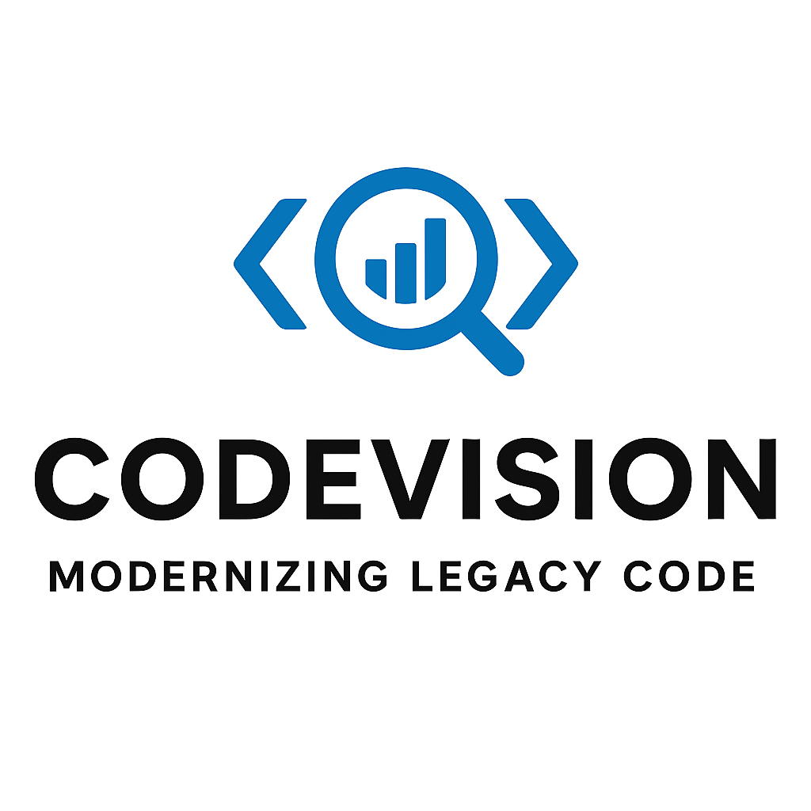

# Welcome to CodeVision Academy

Welcome to the **CodeVision AI & Python Training Program** — a comprehensive, hands-on journey from Python fundamentals to building production-ready AI solutions.

This program is designed for professionals who want to understand and apply AI technologies in real-world business contexts. Whether you're starting from scratch or looking to formalise your existing knowledge, this training will take you from zero to confident AI practitioner.

---

## What You'll Learn

By the end of this program, you will be able to:

- Write clean, effective Python code for data processing and automation
- Understand how Large Language Models (LLMs) work and how to prompt them effectively
- Build and query vector databases using embeddings
- Create RAG (Retrieval-Augmented Generation) pipelines
- Develop AI agents that can automate complex tasks
- Design and implement end-to-end AI solutions for business problems

---

## Course Structure

| Module | Topic | Duration |
|--------|-------|----------|
| **1** | Python Foundations | 12 hours |
| **2** | Python for Data Work | 12 hours |
| **3** | LLM Fundamentals | 8 hours |
| **4** | Embeddings & Vector Databases | 8 hours |
| **5** | LLM APIs (Python) | 8 hours |
| **6** | RAG Pipelines | 12 hours |
| **7** | Agents & Automation | 8 hours |
| **8** | Capstone Project | 12 hours |
| | **Final Certification Exam** | 2 hours |

**Total Program Duration:** ~82 hours

---

## Module Overview

### Module 1: Python Foundations
*Zero-to-confident Python user.* Learn variables, types, control flow, functions, file handling, and JSON processing. Complete a mini-project processing real data.

### Module 2: Python for Data Work
*Build comfort with real-world data transformations.* Master Pandas for reading, filtering, and cleaning data. Create visualisations with matplotlib.

### Module 3: LLM Fundamentals
*Understand how LLMs work.* Learn about tokenization, embeddings, context windows, and prompt engineering. Handle safety and hallucination challenges.

### Module 4: Embeddings & Vector Databases
*Your first "Aha!" moment.* Understand embeddings, cosine similarity, and FAISS. Build your first embed-store-query pipeline.

### Module 5: LLM APIs (Python)
*Make your first AI-powered application.* Call OpenAI, NVIDIA, or Ollama APIs. Handle streaming, retries, and errors.

### Module 6: RAG Pipelines
*Build production RAG solutions.* Learn chunking strategies, embedding pipelines, query rewriting, and retrieval evaluation.

### Module 7: Agents & Automation
*See the future of work.* Understand agent loops, tools, functions, and routing models. Build LLM-powered automation.

### Module 8: Capstone Project
*Bring it all together.* Build a complete end-to-end AI assistant for a real business problem.

---

## Certification

Complete the program by passing the **Final Certification Exam**:
- 20 MCQs on Python
- 20 MCQs on LLM concepts
- 1 coding problem
- 1 solution design question
- **Passmark: 70%**

---

## Getting Started

Use the navigation on the left to begin with **Module 1: Python Foundations**. Each module includes:
- Interactive lessons with runnable code
- Quizzes to test your understanding
- Additional resources for deeper learning

> **Note:** This is a practical, hands-on program. Every concept is tied to examples you'll reuse throughout your AI journey. Let's begin!
